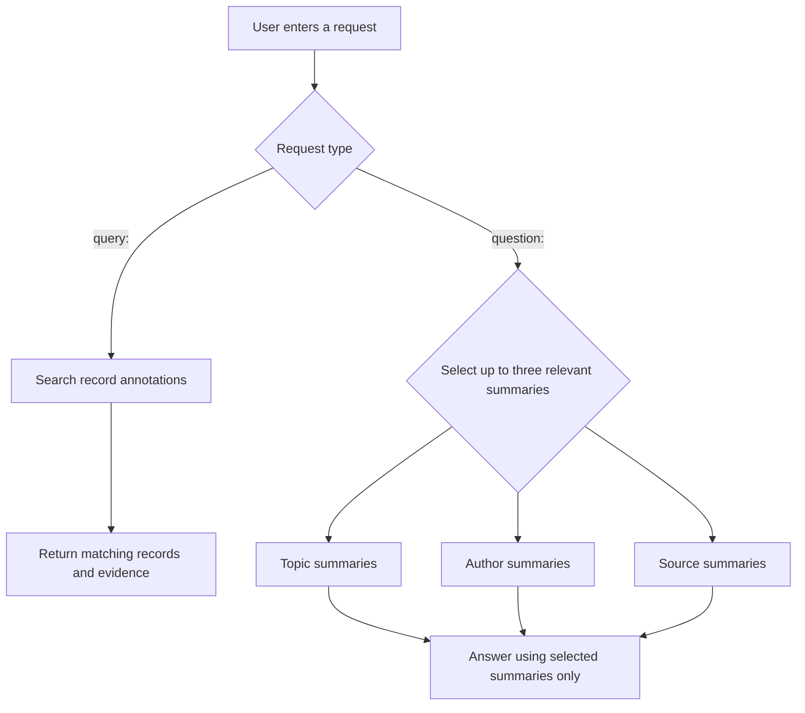

# The Analyst

`the_analyst.py` is the primary interface to the knowledge base. It provides an
interactive research assistant over:

## Start analyst

Interactive mode:

```powershell
python the_analyst.py
```

One-shot mode:

```powershell
python the_analyst.py "question: What research discusses MCP security?"
```

Show available commands and tools:

```text
help
```

## Request Modes

Most requests can be written naturally. analyst selects a tool based on the
question.

Two prefixes force deterministic routing:

```text
question: How is threat modeling being done using AI?
query: cryptocurrency wallet fraud
```

`question:` loads relevant generated summary files and asks the QA model to
synthesize an answer from only those files.

`query:` searches structured record annotations and returns matching evidence
without a narrative synthesis step.

## Workflow



## Routing Architecture

analyst uses a hybrid routing model.

For unprefixed natural-language questions, the QA model receives the tool
catalog and chooses a tool. This is the LLM-routing layer used for requests such
as:

```text
report on threat hunting
what has Gadi Evron discussed?
find work on MCP sandboxing
```

After a tool is selected, deterministic Python code validates the request,
selects evidence, and loads only existing files or database rows:

- `parse_prefixed_request()` handles explicit `query:` and `question:` routes.
- `dispatch_tool()` maps the selected tool name to its implementation.
- `rank_relevant_summary_topics()` scores a question against the summary
  catalog and topic descriptions.
- `load_summary_files()` validates, selects, and loads summary files.
- `tool_answer_about_author()` selects an author summary or one complete record.
- `tool_search_records()` performs raw record and exact record-ID lookup.
- `tool_query_annotations()` performs structured annotation lookup.

This division is intentional. LLM tool selection handles semantic ambiguity,
while deterministic selection prevents nonexistent paths, enforces author and
record policies, and keeps evidence loading reproducible.

Summary selection inside `answer-from-summaries` is currently lexical and
deterministic. A future enhancement could let an LLM propose relevant summaries
from a compact catalog, but deterministic code should still validate the
selection and use the lexical ranker as a fallback. Replacing the entire routing
layer with an LLM would add cost, latency, and nondeterministic failures without
removing the need for validation.

## Tool Routing

### `get-status`

Use for database and pipeline state:

```text
How many records are unclassified?
When was the last classification?
Show the current database status.
```

It reports record counts by source, annotation coverage, unclassified records,
last import and classification timestamps, and recent import-log entries.

### `search-records`

Use for exact or raw record lookup:

```text
Find record 64.
Show talks titled Vulnerability Haruspicy.
Find records containing CVSS.
Find this URL.
```

It searches record titles, original author metadata, raw text, tags, and URLs.
Numeric forms such as `64`, `record 64`, and `record_id:64` perform an exact
`records.id` lookup before full-text search.

Results are compact evidence cards. An optional topic filter and explicit result
limit can be supplied. When no limit is supplied, analyst does not apply a small
user-facing default.

### `query-annotations`

Use for deterministic structured evidence lookup:

```text
List records mentioning agent sandboxing.
Find annotations containing OAuth and confused deputy.
Show records involving MCP tools from defcon33.
```

It searches annotation fields including:

- keywords
- tools
- people
- claims
- use cases
- security domains
- AI relevance
- relevance notes
- short summaries

Queries can use `any` or `all` matching and can be filtered by topic or source.

### `answer-from-summaries`

Use for broad synthesis:

```text
What trends are emerging in prompt injection research?
How are teams applying AI to threat modeling?
What do these records say about application security?
```

analyst ranks available topic, source, and author summary files against the
question and loads up to three relevant summaries by default. The QA model must:

- use only the returned summary files
- identify the summaries used
- answer directly in natural prose
- cite `[record_id:n]` when supplied by the summaries
- distinguish common themes from unique records
- state when the available summaries are insufficient

Summary bodies live under:

```text
summaries/topics/
summaries/sources/
summaries/authors/
```

### `answer-about-author`

Use for questions about a named author or speaker:

```text
What has Gadi Evron discussed?
Tell me about Mike Holcomb's work in the database.
```

Authors are resolved through the normalized `authors` and `author_records`
tables.

- Authors with two or more records use `summaries/authors/<author-slug>.md`.
- Authors with one record return the complete underlying record.
- Multi-record authors without a generated summary return their record IDs and
  a message that the author summary must be generated.
- Unknown author names return no records found.

Author lookup currently expects an exact name, case-insensitively.

### `generate-topic-summary`

Use only when explicitly requesting a fresh topic summary:

```text
Regenerate the Threat modeling summary.
Create an updated summary for Application security.
```

The topic must match the curated topic catalog. Generation uses every record
where that topic is primary or secondary, writes the Markdown summary under
`summaries/topics/`, and writes prompt, audit, and manifest artifacts under
`summaries/artifacts/topics/`.

This tool can make an LLM call. It archives the previous summary before
generation. If deterministic coverage still fails after the repair call, the
new summary is marked incomplete and remains on disk for review.

## Evidence Rules

analyst separates lookup from synthesis:

- Raw titles, URLs, author metadata, and record text use `search-records`.
- Structured concepts extracted during annotation use `query-annotations`.
- Broad questions across multiple records use generated summaries.
- Named-author questions use author summaries or the author's single record.

When answering from summaries, analyst is instructed not to fill gaps with
general knowledge. If the evidence is thin, stale, or missing, it should say so.
For prefixed `question:` requests, analyst routes the question to up to three
relevant summary files by default, then answers only from those loaded
summaries.

## Configuration

analyst reads:

```text
config/llm.ini
knowledge_agenting/prompts/analyst_system.txt
.env
```

`knowledge_agenting/prompts/analyst_system.txt` contains the analyst system prompt, including tool
routing and evidence-use instructions.

Relevant settings:

```ini
[provider]
name = openai

[models]
qa = gpt-5.5
```

The API key is read from the environment variable configured for the selected
provider. `LLM_PROVIDER` and `LLM_MODEL_QA` can override the INI settings.

analyst's default maximum QA response is 4,096 tokens unless
`[qa] max_output_tokens` is configured.

## Common Failures

### No summary files found

The requested topic may not have a generated summary, or the summary directory
may be incomplete. Generate the required summary manually or request explicit
topic regeneration.

### Author has multiple records but no summary

Generate author summaries:

```powershell
python -m knowledge_agenting.topic_summarizer --group-by author --all --skip-existing --parallel 4
```

List missing author summaries without generating them:

```powershell
python -m knowledge_agenting.topic_summarizer --group-by author --all --list-missing
```

The default includes authors with at least two records.

### Unknown topic

Topic summary regeneration requires an exact curated topic name. analyst returns
close matches or the valid topic list when possible.

### Thin answer

Summary-based answers can only be as complete as the generated summary files.
Use raw record search or annotation queries to inspect narrower evidence.

## Safety

analyst reads the knowledge database for ordinary questions. The only exposed
write operation is explicit topic-summary regeneration. It does not
automatically classify records or mutate topic assignments.

## Routing Smoke Test

Verify that current summary files are selected for relevant questions without
making LLM calls:

```powershell
python tools\summary_routing_smoke.py
```

The smoke test covers every topic, source, and author summary currently on disk,
plus ten natural-language questions for each seed topic, all stored explicitly
in `config/summary_routing_smoke.json`. The topic cases include short, indirect,
scenario, ambiguous, and cross-topic questions rather than repeating canonical
topic titles or seed descriptions. Curated cases use the same lexical
`question=` ranking path as prefixed `question:` requests. It exits nonzero when a summary cannot be
selected or when a stale single-record author summary remains on disk. Every
check prints its question, expected summary, and selected summary. Complete run
details are appended to:

```text
tests/logs/summary-routing-smoke-<timestamp>.log
```

Use `--quiet` for totals and failures only while retaining the complete log.

Rebuild the explicit case file after editing its topic-specific routing cues:

```powershell
python tools\build_summary_routing_smoke_cases.py
```

The smoke test calls the deterministic functions above directly. It verifies
that a relevant question selects the expected summary after a tool has been
chosen. It does not call the QA model and therefore does not test whether the
LLM will choose the correct tool for every ambiguous question. End-to-end
tool-selection testing requires live LLM calls or a controlled mock model.

Deterministic topic routing combines the canonical topic metadata with compact
production aliases in `config/topic_routing_aliases.tsv`. Explicit contrast
phrases such as "not X, the real issue is Y" are reduced to the asserted
subject before ranking. If no summary matches, the router returns no summary
instead of silently selecting the first file on disk.

### Live LLM routing evaluation

Evaluate the same curated questions with a configured LLM selecting exactly one
summary:

```powershell
python tools\llm_summary_routing_eval.py
```

Validate the catalog and planned call count without making API calls:

```powershell
python tools\llm_summary_routing_eval.py --dry-run
```

Use `--limit 10` for a small live sample or `--repeats 3` to measure selection
consistency. Each attempt is appended as a readable text block under
`tests/logs/llm-summary-routing-<timestamp>.txt`, followed by aggregate
accuracy, status counts, latency, and token usage. Questions whose expected
summary is missing are reported as `missing_expected_summary` and excluded from
the accuracy denominator.

Archive stale single-record author summaries and rerun the checks:

```powershell
python tools\summary_routing_smoke.py --archive-stale-authors
```
Current/active prompts:

annotate_system.txt - used by annotation calls via ANNOTATE_SYSTEM in [common.py (line 37)]

classify_system.txt - used as CLASSIFY_SYSTEM_TEMPLATE in [common.py (line 36)]

open_topic_system.txt - used by open topic discovery in [open_topics.py (line 23)]

topic_summary_system.txt - used by the newer grouped summarizer in [topic_summarizer.py (line 33)

topic_summary_user.txt - used to build the newer grouped topic/source/author summary prompt in [topic_summarizer.py (line 465)
