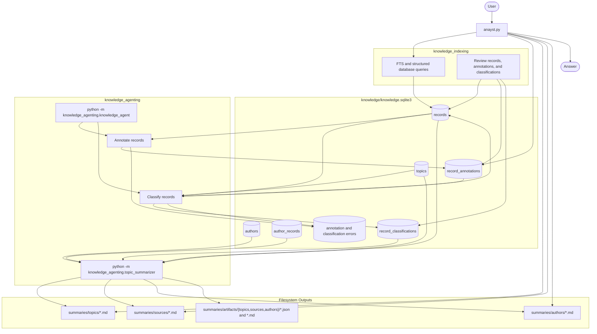

# Data Flow

The Analyst is a research and analysis pipeline built around an existing SQLite knowledge base. Source scraping, collection, and ingestion are outside this project. Nothing annotates, classifies, or summarizes records automatically.




## Project Boundary

The pipeline begins with:

```text
knowledge/knowledge.sqlite3
```

How source material is scraped, collected, transformed, or inserted into that
database is not part of this project. Within the database, `records.author`
retains source provenance while `authors` and `author_records` provide normalized
individual-author relationships.

## Enrichment

Annotation and classification are separate manual operations:

```powershell
python -m knowledge_agenting.knowledge_agent annotate
python -m knowledge_agenting.knowledge_agent classify
```

Annotation writes compact structured evidence to `record_annotations`.
Classification reads records, annotations, and the curated `topics` table, then
writes `record_classifications` and `records.agent_topics`. Failed calls are
recorded in durable error tables. Database changes do not trigger
classification.

## Summaries

Grouped summaries are generated manually:

```powershell
python -m knowledge_agenting.topic_summarizer --group-by topic --all
python -m knowledge_agenting.topic_summarizer --group-by source --all
python -m knowledge_agenting.topic_summarizer --group-by author --all
```

Topic summaries include records where the topic is primary or secondary. Source
summaries include every record from that source. Author summaries use normalized
author links and default to authors with at least two records.

Summary bodies are Markdown files, not SQLite rows. Prompt inputs, audits,
manifests, and archived prior runs are stored under
`summaries/artifacts/<group>/`.

## Questions

Run Analyst with:

```powershell
python the_analyst.py
```

Analyst routes requests to raw record search, structured annotation queries, topic/source/author summary files, or exact author evidence. Multi-record authors use their generated author summary; a single-record author returns the complete underlying record.